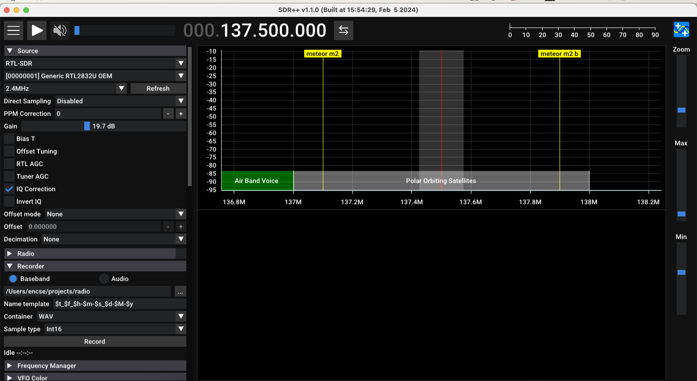
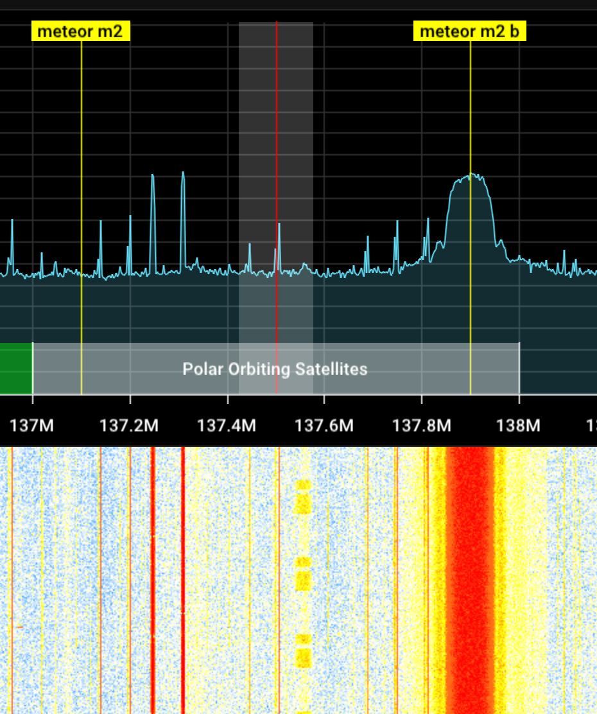
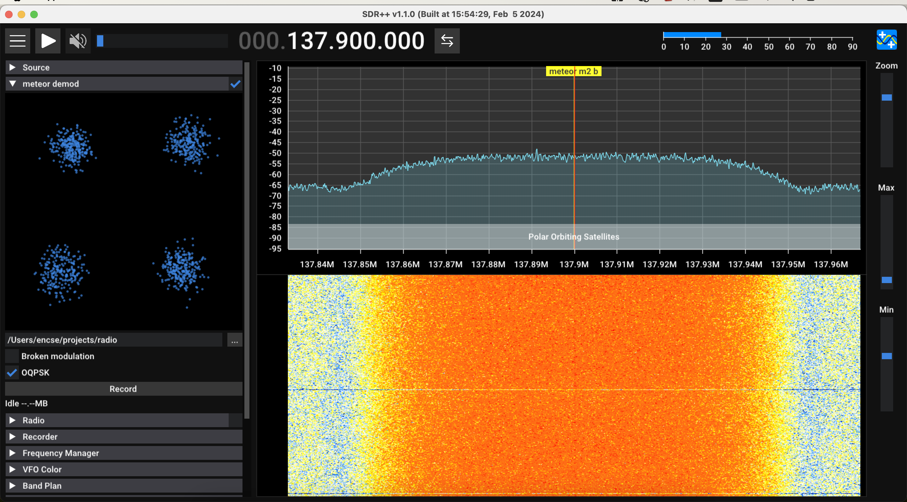

# Capturing METEOR M2 LRPT images using SDR++ and meteordemod

Getting pictures from weather satellites is a great hobby. At the beginning of 2024 there are three NOAA satellites (NOAA 15, 18 and 19) and Meteor M2 (aka Meteor-M N2-3) that broadcast live images of Earth in the 137Mhz band. You can imagine them as giant scanners (the size of a fridge or even bigger) that continously scan the ground 24/7 and send down the signal to fellow radio operators like you. They have strong signals on low freqencies which is ideal for amateur reception.

We will focus on Meteor captures, but the following applies in general.

The satellite is over you for about 10-15 minutes per pass. You can usually try your luck on one or two passes in the morning hours and an other 1-2 in the evening per satellite. That's about 16 passes per day.

One orbit takes roughly 90 minutes for the satellite. For example, if they show up at 8:00 AM in the morning then the second wave begins around 9:30. The same pattern repeats later in the evening hours.

You will see that when they come from North to South in the morning they seem to change direction during the day and fly from South to North in the evening. But it's actually the Earth that makes a half turn in 12 hours and the sats stay on the same orbit. It's your perspective that changes...

Timing also changes continously. These sats have a sun-synchronized orbit, which means that they will pass over your location during the day. The maximum elevation of a sat also changes and you should not expect high quality signals if it gets below 20º degrees. On top of that, if two satellites use the same frequency and their orbit gets in sync, they interfere with each other making the decoding hard or impossible. It's the space equivalent of a truck taking over an other truck on the highway. It's better to come back a week later in that case.

It's important to plan ahead. I use the tool called `gpredict` or the n2yo website for preparation. Here is a [link](https://www.n2yo.com/passes/?s=33591&a=1) to NOAA-19 forecasts for example. 

## Technology

Some of the technology is super old, it dates back to the 70s or even earlier. NOAA satellites use a protocol called APT which has a distinct beeping sound, immediately recognized by the trained ears. It's about as complex as something you would connect to a fax machine and get it printed. A variation of this is called WEFAX which is still in use by marine weather forecasts sent by radio towers from coastal cities. These signals are so strong that they can be received from a distance of 1000 km inland.

Meteor uses more recent technology (LRPT) and can fit more data in a digitally encoded signal. The images have higher quality when compared to an APT image, but it's also more prone to errors. Under circumstances when an APT image looks noisy, the LRPT eqivalent is just black. To make things worse Meteor M2's antenna has some issues and it's not radiating at full power making the reception even harder.

We should mention that the same satellites also have an HRPT transmitter that operates on high frequencies and broadcasts even higher quality images. That requires better tooling and precisely controlled satellite tracking systems (or very stable hands). It's possible with tools around the house, but one has to be determined to try his hands on that.

LRPT looks like a sweet spot both in quality and the patience required.

# Tools
I have an RTL-SDR v3 dongle with its dipole kit. I bought a Sawbird + NOAA amplifier, and built a Yagi Uda antenna from tape measures and a PVC pipe tuned for 137.5Mhz to improve my signal level. Yagi Uda is a directional antenna, which means that I need to manualy track the satellite as it flies over my head.

I'm on a mac and there are not many choices for the software side, but luckly enough, the cross platform `SDR++` works really well. I also have `gpredict` that lets me know when the satellite comes and shows me where to point my antenna. To decode Meteor images I either use `Satdump UI` or `meteordemod`.

## How to

Once you have a nice pass, something greater than 25º of maximal elevation should suffice, go outside, check your equiment (double check the connections) and wait. First you should try to create a baseband capture. Later you can speed up the process, but at the beginning it's better to start with something that is replayable. That lets you figure out things in smaller steps.

I set up my SDR++ like this, bandwidth is at 2.4Mhz. Unlike in the screenshot below, I also need to turn on Bias-T to power my amplifier. *Do this only if you have an amplifier attached, as it can damage your SDR otherwise. It connects 5V to the antenna cable and if it is sorted, the voltage gets back to the SDR and will kill it after a while.*

Gain is manually set to a level where the background noise is still not raising high. 



Click the Record button in the Recorder panel. (Make sure it's set to Baseband).

Meteor's signal should look like a small hill or hunk on the top of the background noise, it's clearly visible to the right in the picture below. There are other peaking signals here and there, but those will not cause problems in the decoding. Meteor M2 operates either on 137.1 Mhz or 137.9 Mhz. It is switching every once in a while, so I set my center frequency to 137.5 Mhz to see both. At the time of this recording it was using 137.9 Mhz.



Once you have a capture file, you can replay it in SDR++ by selecting the "File" source. 

*Tip: disable the 'radio' plugin for this step, it lets SDR++ decode the signal with a very high speed. We cannot listen to it anyway, there is no need to replay it in realtime.*

Make sure you add and activate `meteor_demodulator` plugin in the module manager, then zoom into the signal, like it's shown in the image to the right. You should see the four dot pattern appearing in the demodulator panel:



Meteor uses a version of the QPSK encoding where Q means quadratic refering to the fact that data is chunked into a sequence of 2 bits at a time (00, 01, 10 or 11). The four dots in the picture correspond to these bit pairs. The signal is jumping between these super quickly.

We have a clear pattern! Record this to create an .S file. "S" for soft samples. 

Soft samples can be processed by other tools such as `Satdump`, but I like doing it from the command line, so I will use `meteordemod.sh` from this repo. 

We need to build the container first, which is (supposing you also have docker) as simple as:

```bash
docker build . -t meteordemod
```

`meteordemod.sh` mounts the current working directory under `/data` in the container and forwards arguments to the underlying `meteordemod` executable.

First we should update the TLE database, this tells the software the orbit of the satellites (so that it can calculate where it is right now):

```bash
./meteordemod.sh download-tle
```

this puts `weather.tle` into the current directory, obtained from https://celestrak.org.

We are finally ready to decode the image. If I need to extract something I usually just write:

```bash
./meteordemod.sh 72k inputfile.s 
```
or

```bash
./meteordemod.sh 80k inputfile.s
```

It's also a setting of the satellite wether it transmits with 72k or 80k. This time it was on 72k. I was told that the waterfall of these looks different, so it's possible to tell it with some practice, but I cannot really tell which one it is. One of these settings should work anyway.

The tool generates several images and composites, here is one of them. It's not a super-duper capture, I have created much better ones earlier.


## Backdoor 

If I need to go deeper I can just invoke the script with some other arguments such as:

```bash
./meteordemod.sh -m oqpsk -diff 1 -s 72e3 -sat METEOR-M-2-3 -t weather.tle -f png -i ...
```

